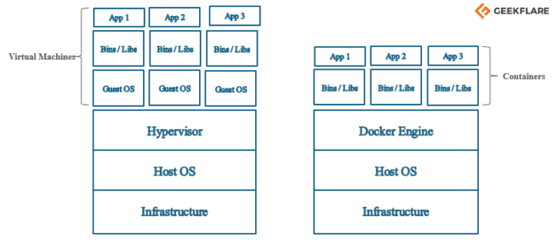
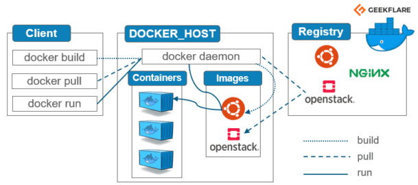

# How to use Docker. (Press link below to check all the GitBook). 

## [How to use Docker](https://geobla.gitbook.io/how-to-use-docker/)

***

## description:

### Personal Docker notes, that I would like to share, to help someone out.

All notes are from freecodecamp YouTube video. [https://www.youtube.com/watch?v=fqMOX6JJhGo\&t=1458s](https://www.youtube.com/watch?v=fqMOX6JJhGo\&t=1458s)

If you are more of a note personality like me, rather than having to play the video all the time, i believe these notes will help you out.

### Traditional vs. New-Generation Virtualization <a href="#h-traditional-vs-new-generation-virtualization" id="h-traditional-vs-new-generation-virtualization"></a>

clipped from [https://geekflare.com/docker-architecture/](https://geekflare.com/docker-architecture/)&#x20;

Earlier, we used to create virtual machines, and each VM had an OS which took a lot of space and made it heavy.

Now in docker container’s case, you have a single OS, and the resources are shared between the containers. Hence it is lightweight and boots in seconds.



### Docker Architecture <a href="#h-docker-architecture" id="h-docker-architecture"></a>

Below is the simple diagram of a Docker architecture.



Let me explain you the components of a docker architecture.

#### Docker Engine <a href="#h-docker-engine" id="h-docker-engine"></a>

It is the core part of the whole Docker system. Docker Engine is an application which follows **client-server architecture**. It is installed on the host machine. There are three components in the Docker Engine:

* **Server**: It is the docker daemon called **dockerd**. It can create and manage docker images. Containers, networks, etc.
* **Rest API**: It is used to instruct docker daemon what to do.
* **Command Line Interface (CLI)**: It is a client which is used to enter [docker commands](https://geekflare.com/docker-commands/).

#### Docker Client <a href="#h-docker-client" id="h-docker-client"></a>

Docker users can interact with Docker through a client. When any docker commands runs, the client sends them to dockerd daemon, which carries them out. Docker API is used by Docker commands. Docker client can communicate with more than one daemon.

#### Docker Registries <a href="#h-docker-registries" id="h-docker-registries"></a>

It is the location where the Docker images are stored. It can be a public docker registry or a private docker registry. Docker Hub is the default place of docker images, it stores public registry. You can also create and run your own [private registry](https://geekflare.com/docker-private-registry-ubuntu/).

When you execute docker pull or docker run commands, the required docker image is pulled from the configured registry. When you execute docker push command, the docker image is stored on the configured registry.

#### Docker Objects <a href="#h-docker-objects" id="h-docker-objects"></a>

When you are working with Docker, you use images, containers, volumes, networks; all these are Docker objects.

**Images**

Docker images are read-only templates with instructions to create a docker container. Docker image can be pulled from a Docker hub and used as it is, or you can add additional instructions to the base image and create a new and modified docker image. You can create your own docker images also using a [dockerfile](https://geekflare.com/dockerfile-tutorial/). Create a dockerfile with all the instructions to create a container and run it; it will create your custom docker image.

Docker image has a base layer which is read-only, and the top layer can be written. When you edit a dockerfile and rebuild it, only the modified part is rebuilt in the top layer.

**Containers**

After you run a docker image, it creates a docker container. All the applications and their environment run inside this container. You can use Docker API or CLI to start, stop, delete a docker container.

Below is a sample command to run a ubuntu docker container:

```bash
docker run -i -t ubuntu /bin/bash
```

**Volumes**

The persisting data generated by docker and used by Docker containers are stored in Volumes. They are completely managed by docker through docker CLI or Docker API. Volumes work on both Windows and Linux containers. Rather than persisting data in a container’s writable layer, it is always a good option to use volumes for it. Volume’s content exists outside the lifecycle of a container, so using volume does not increase the size of a container.

You can use -v or –mount flag to start a container with a volume. In this sample command, you are using geekvolume volume with geekflare container.

```bash
docker run -d --name geekflare  -v geekvolume:/app nginx:latest
```

**Networks**

Docker networking is a passage through which all the isolated container communicate. There are mainly five network drivers in docker:

1. **Bridge**: It is the default network driver for a container. You use this network when your application is running on standalone containers, i.e. multiple containers communicating with same docker host.
2. **Host**: This driver removes the network isolation between docker containers and docker host. It is used when you don’t need any network isolation between host and container.
3. **Overlay**: This network enables swarm services to communicate with each other. It is used when the containers are running on different Docker hosts or when swarm services are formed by multiple applications.
4. **None**: This driver disables all the networking.
5. **macvlan**: This driver assigns mac address to containers to make them look like physical devices. The traffic is routed between containers through their mac addresses. This network is used when you want the containers to look like a physical device, for example, while migrating a VM setup.
