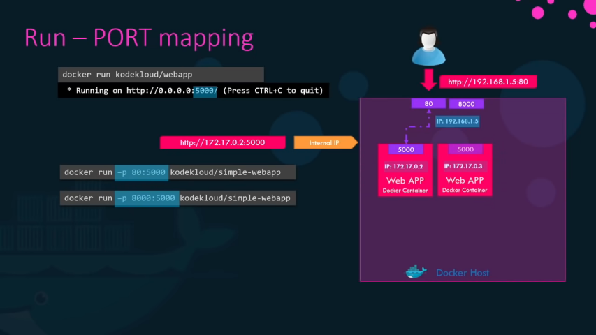
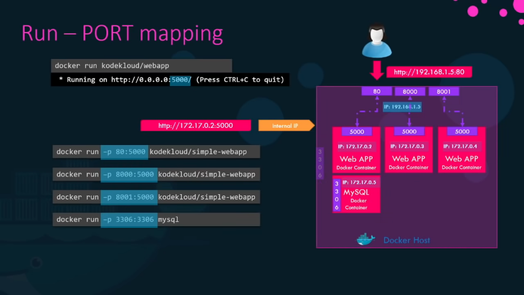
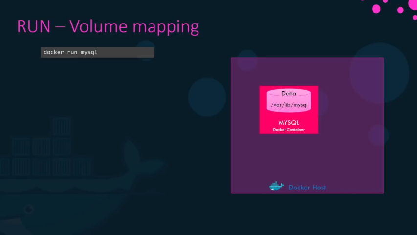
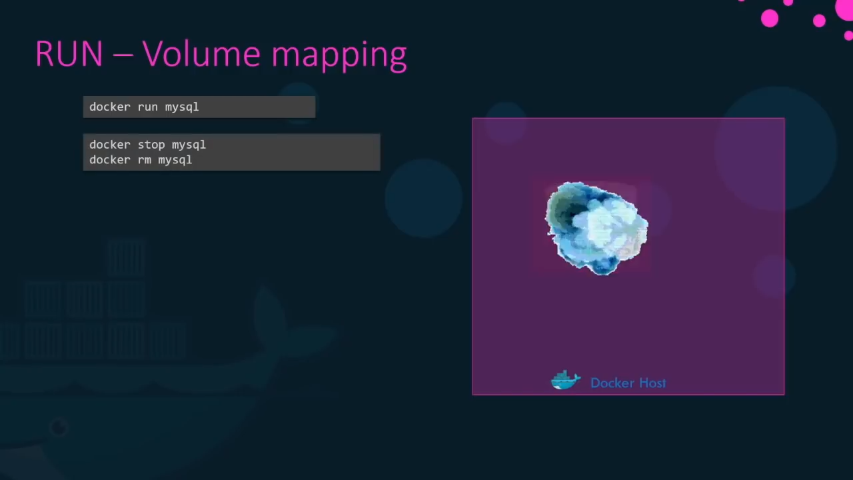
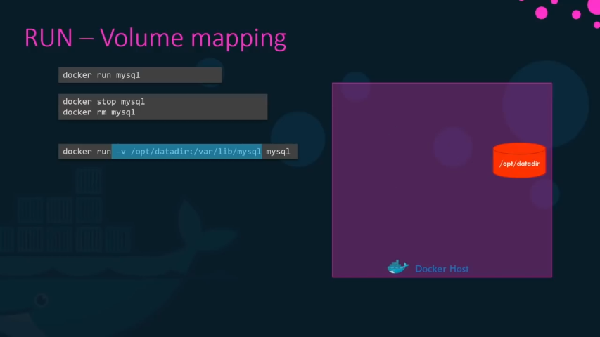
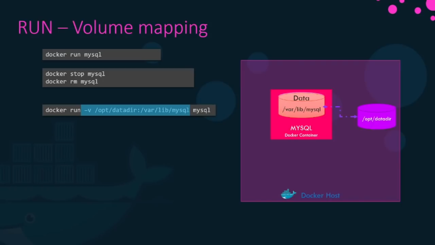
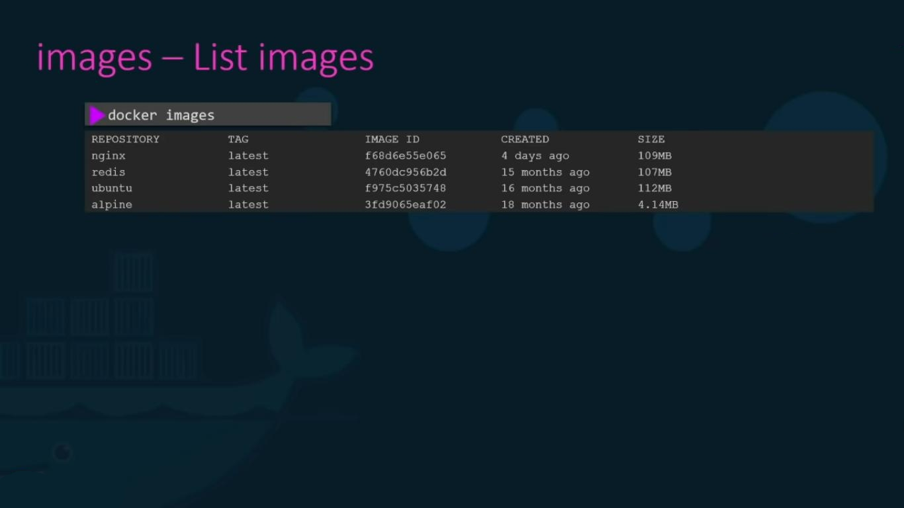

# Docker Commands.

### docker run

```bash
docker run <imageName>
```

This will run the selected image. &#x20;

If the image is not inside the server, it will go to the docker hub, download, and then run it.&#x20;

but this is only done the first time. After the first time it will use your downloaded image.   &#x20;

For example:&#x20;

.png)

### run -i / run -it.

Lets imagine we have a simple prompt app that when run, asks for a name and prints a welcome message afterwards.


If we dockerize this app and run it as a container, it will not wait for the prompt. It will execute immediately, on Standard Out (stdout).


That's because, even though we are attached to dockers console, it is not able to read any input from you. It doesn't have a terminal to read inputs from.

To get around it, we must map the Standard Input (stdin) of the host to the docker.

For that we use the <mark style="color:green;">-i</mark> parameter. i stands for interactive mode.&#x20;

```bash
docker run -i <name>
```


Now we can type a name and get an output.

But we are still missing the prompt. That's because the terminal is not attached.&#x20;

To attach a terminal we include the <mark style="color:green;">-t</mark> (<mark style="color:green;">t</mark>erminal).

```bash
docker -it <name>
```


### run Port Mapping.

Lets run the application in a docker container inside a docker host. &#x20;


We see that the app is running, and also see the server info. (ip:port)

But how can an external user access the app?

#### 1st option

Use the ip of the docker container it runs on. Every docker container has an ip assigned by default.&#x20;


To get the container ip address run the following command:

```bash
docker inspect -f '{{range.NetworkSettings.Networks}}{{.IPAddress}}{{end}}' <container-ID>
```

But this ip is only accessible from inside the docker host.

If we want to access the specific app from outside we must use the docker host (your pc or server) ip address.&#x20;


But for that to work, we must map the port inside the docker container, to a free port on the docker host.

For example if we want external users to use port 80 on the docker host, we must map port 80 docker host to port 5000 docker container using the -p parameter.

```bash
docker run -d -p <dockerHostPort>:<dockerContainerPort>
```


<mark style="color:red;">Don't forget</mark> to change https to http in URL!!!

Now all traffic from port 80 is being sent to port 5000 of the container.

Using this method we can run multiple instances of the same application, and map them to different port of the host.



Or run different applications on different ports. (MySQL example running on default port 3306).



We can run as many applications at as many ports as we want. <mark style="color:red;">BUT</mark> we can <mark style="color:red;">NOT</mark> map on a docker host port already in use.

### Volume Mapping.

Suppose we run a Mysql docker container. All the databases and tables are stored inside the container, in the /var/lib/mysql directory.

Remember every container has its own file system. &#x20;



What will happen if we choose to remove the container?

All the data and tables would be lost.



If we want to keep the data, after we remove the container, or keep a backup, we must map a directory from the container to the hosts PC using the -v in our command.&#x20;

To do this, in our example, we create a directory in the host (our) PC and name it /opt/datadir and map (connect) it to the dockers container /var/lib/mysql.

```
docker run -v /hostdir/:/containerdir/ <containerName>
```

This way the docker container will mount the host directory inside it, and all the data will be stored in the host directory, even when the specific container crushes or gets removed.






### docker ps

```bash
docker ps
```

Lists all running containers and some basic info about them.&#x20;

Each container gets a random ID and name assigned to it.

.png)

### docker ps –a

```bash
docker ps –a
```

If we use this command, we will also get the previous terminated containers.

.png)

### Stop a container from running.

To stop a container from running we use the command:

```bash
docker stop <name> 
```

We confirm with **Status** must be **Exited.**

.png)

### Remove a Container.

Use the command&#x20;

```bash
docker rm <name> 
```

If we get the name back, we are OK.&#x20;

Running afterwards the &#x20;

```bash
docker ps –a 
```

We should not see it at all.&#x20;

.png)

* But the rm command <mark style="color:red;">does not remove</mark> the image nor any remaining docker files and folders.&#x20;

### List docker images & Remove unused.

Use the &#x20;

```bash
docker images 
```

command to get the images list on your server.&#x20;



To remove an image run:

```bash
docker rmi <imageName>
```

.jpeg)

* <mark style="color:red;">IMPORTANT!!</mark>&#x20;

Remove all depended containers <mark style="color:red;">BEFORE</mark> removing the image!! (Check previous step).

### Removing All Unused Docker Objects <a href="#removing-all-unused-docker-objects" id="removing-all-unused-docker-objects"></a>

The `docker system prune` command removes all stopped containers, dangling images, and unused networks:

```bash
docker system prune
```

If you want to remove all unused images not just the dangling ones, add the `-a` (`--all`) option to the command:

```bash
docker system prune -a
```

By default, the command doesn’t remove unused volumes to prevent losing important data. To remove all unused volumes, pass the `--volumes` option:

```bash
docker system prune --volumes
```

### ONLY download image and DO NOT run.

If we **ONLY** want to download the image but **NOT RUN** the container at the same time we use the command:

```bash
docker pull <imageName>
```

.jpeg)

