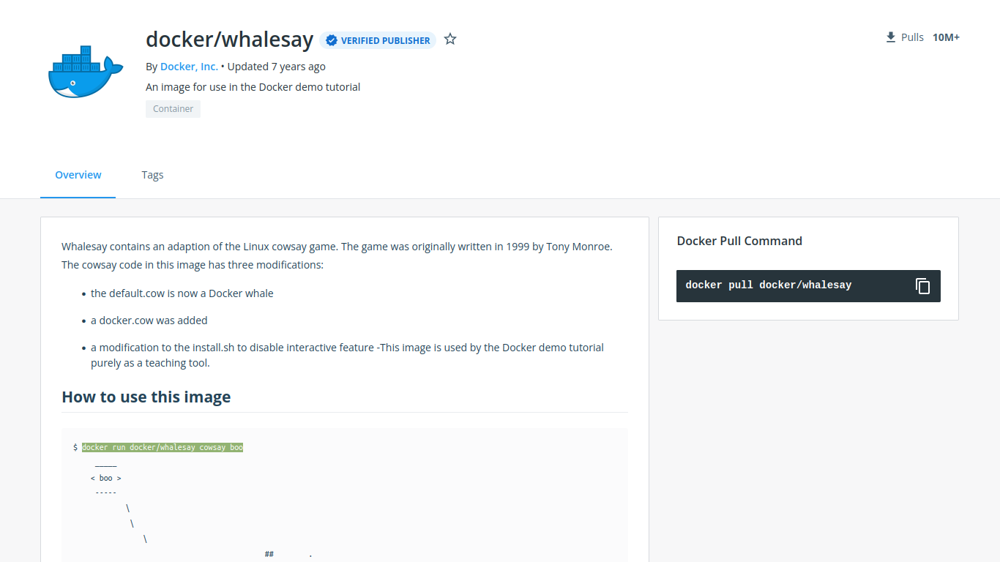

# Containers

When we run an image of an OS like UBUNTU, we will notice that immediately stops (Exited). &#x20;

This is because a docker container is not a virtual machine, but is a software designed to run a specific task inside this OS. &#x20;

If for some reason, the task inside this container stops or crashes, the container will exit.

