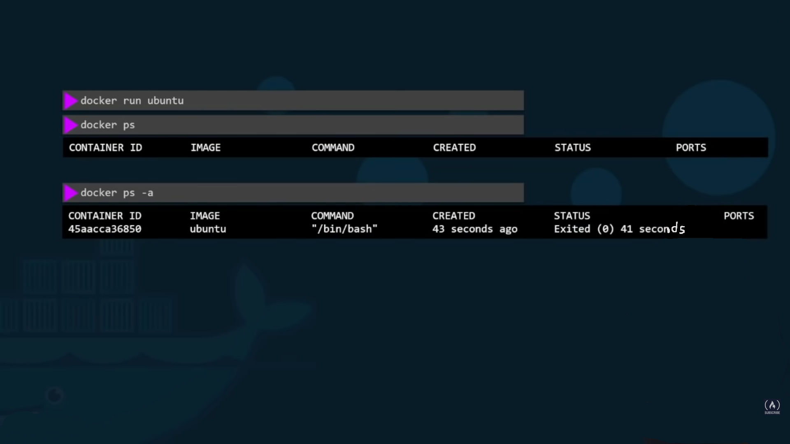

# Containers

### Container Behavior.

When we run an image of an OS like UBUNTU, we will notice that it immediately stops (Exited). &#x20;

This is because a docker container is not a virtual machine, but is a software designed to run a specific task inside this OS. &#x20;

If for some reason, the task inside this container stops or crashes, the container will exit.



### Check files and folders inside a container.

To check for contents inside a running container, we run:

```bash
docker exec <name> <command>
```

.png)

### Run vs Attach & Detach.

If we simply use the run command, to start a container running, we will face a problem.

We will be stuck in the current terminal, not able to proceed with any other actions, until this container stops.

To stop the container from running, we press Ctrl+C to stop.


A better way is to use the command:

```bash
docker run -d <name>
```


The <mark style="color:yellow;">-d</mark> part of the command, will run the container in the <mark style="color:yellow;">detached</mark> mode. This will have a result of running the container in the background, and you will be able to use the terminal, or anything else.
