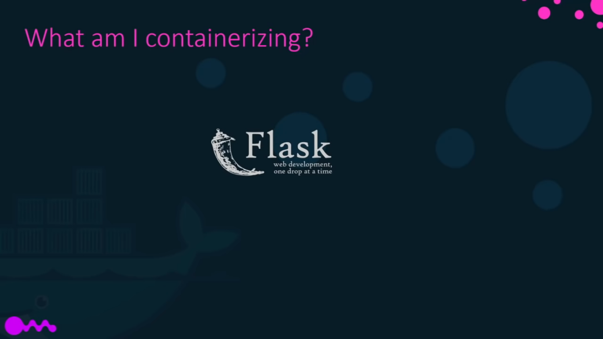
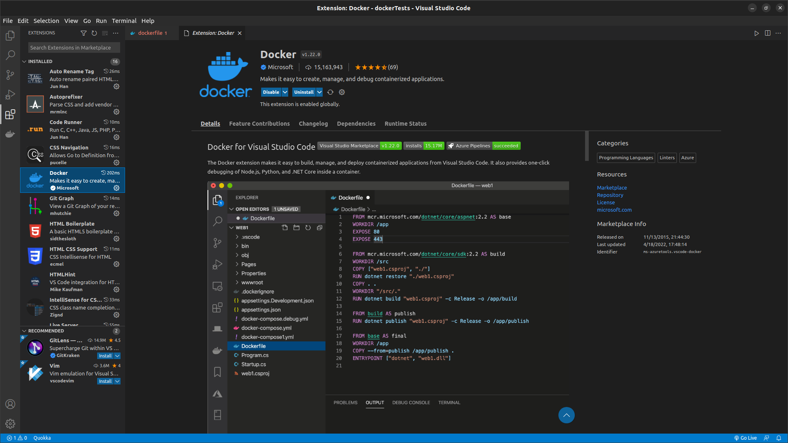
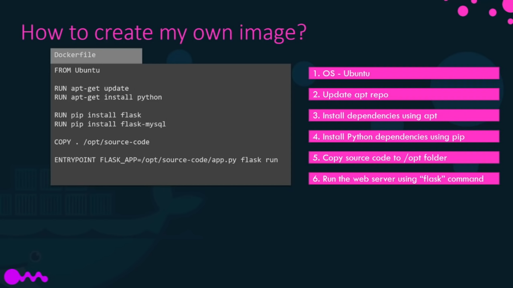
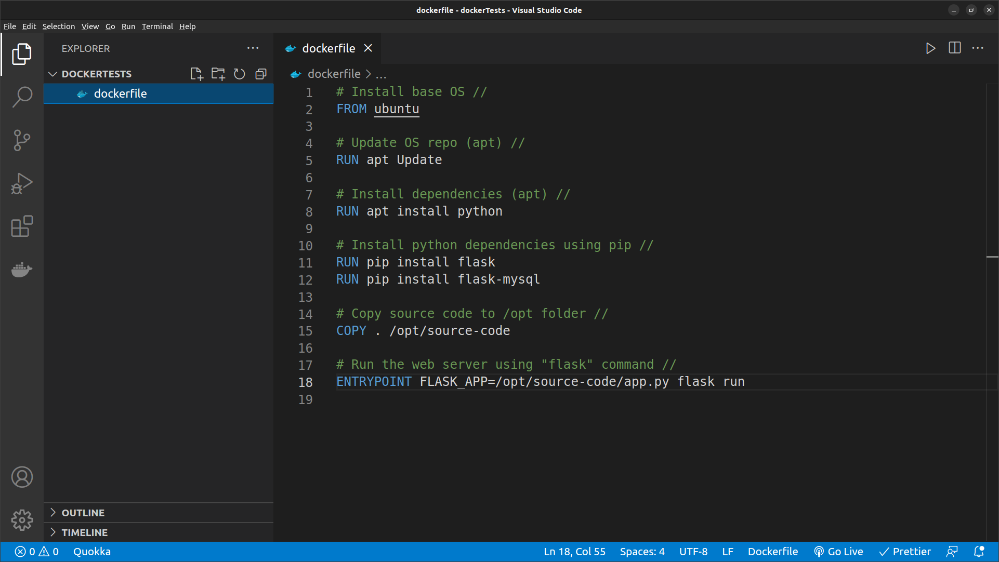

# Docker Images

Lets create an image containing a simple web app, created with python and Flask.

1. First we have to think and write down all the steps required to run an application.

2\. Create a dockerfile (use VS CODE / install docker app).&#x20;

